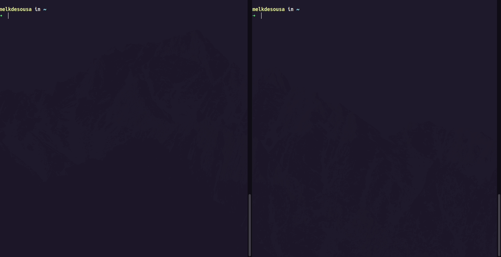

<h1 align="center">
    

Hacker Chat

</h1>

 

  

## 🚀 Tecnologias

Esse projeto foi desenvolvido com as seguintes tecnologias:

- [Node.js](https://nodejs.org/en/)
- [Blessed](https://github.com/chjj/blessed)

## 💻 Projeto

O Hacker Chat é uma aplicação de linha de comando (CLI) para troca de mensagem, ao estilo WeChat, em que um usuário pode entra em uma sala e bater um papo com a galera que estiver lá.

## ✅ Considerações

Este projeto foi desenvolvido durante a [Semana JSExpert 3](https://javascriptexpert.com.br/), ministrada pelo gênio [@ErickWendel🤯](https://github.com/erickwendel).
